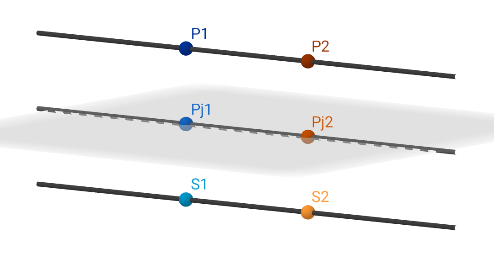

## PSOverGeoforms

  
  <figcaption style="font-style:italic;font-size:10;">Example of a line and points with its projections and symmetrics over a plane</figcaption>

This is a terminal application used to perform the calculation of the projection and the symmetric of a:

- given point over a line;
- given point over a plane; or a 
- given line over a plane.

The math around this problem is quite simple and involves basic concepts on analytical geometry. However, although the same task could’ve been achieved with a way easier and simpler code, some complexity was added in this case just for testing purposes.

The environment that is being used for this development is the Visual Studio Code in Windows 11 paralleling the MSVC compiler, specifically its C++ 20 version.

To check the results, consider using [GeoGebra 3D](https://www.geogebra.org/3d).

### 🚫 Warning
**Don’t try to compile this code!**
This code is until under review and it’s not entirely developed. As soon as it has finished, this warning will be removed.
